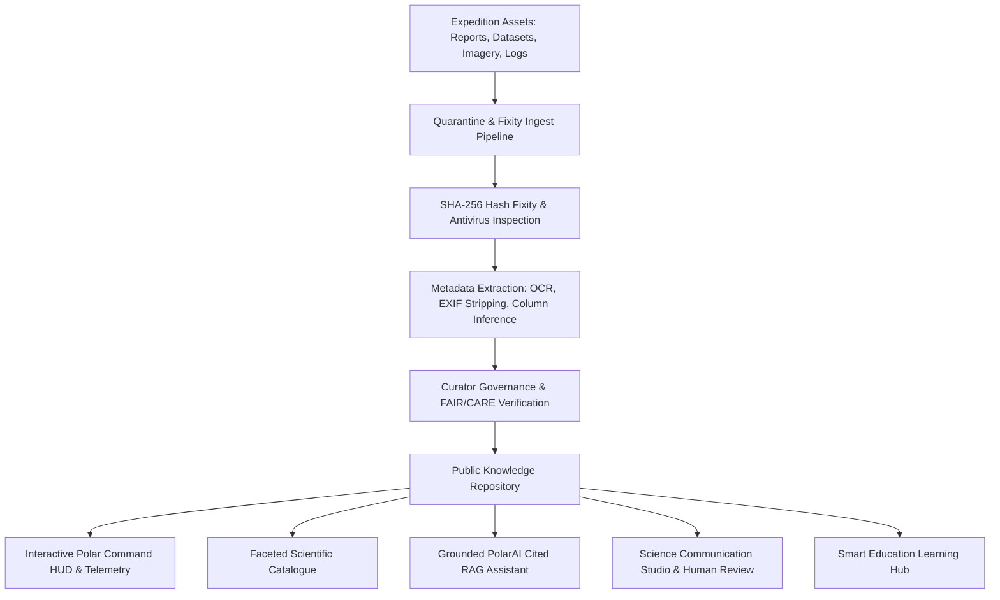

# ❄️ PolarConnect — Integrated Polar Science Outreach, Knowledge Repository & Media Dissemination Portal

[](https://www.sih.gov.in/)
[](https://ncpor.res.in/)
[](docs/data-governance.md)
[](https://www.typescriptlang.org/)
[](https://react.dev/)
[](infra/docker-compose.yml)

> **PolarConnect** is a trusted public discovery and science outreach layer designed for the **Ministry of Earth Sciences (MoES)** and the **National Centre for Polar and Ocean Research (NCPOR)**. Connected to—rather than replacing—the authoritative **National Polar Data Centre (NPDC)**, PolarConnect bridges India’s extreme-environment scientific expeditions with students, researchers, educators, journalists, and policy makers worldwide.

---

## 📑 Table of Contents

- [Vision & Problem Statement](#-vision--problem-statement)
- [System Architecture](#-system-architecture)
- [Key Features](#-key-features)
- [Compliance & Data Governance](#-compliance--data-governance)
- [Repository Structure](#-repository-structure)
- [Quick Start Guide](#-quick-start-guide)
  - [Prerequisites](#prerequisites)
  - [Local Development (Monorepo)](#local-development-monorepo)
  - [Docker Compose Deployment](#docker-compose-deployment)
- [API Reference](#-api-reference)
- [PolarAI Grounded RAG Assistant](#-polarai-grounded-rag-assistant)
- [Evaluation & Benchmarking](#-evaluation--benchmarking)
- [Stakeholders & Acknowledgements](#-stakeholders--acknowledgements)

---

## 🎯 Vision & Problem Statement

### **SIH Problem Statement 26063**
India maintains pioneering year-round research stations across the planet's extreme cryospheric regions:
* **Antarctica:** *Maitri* (Schirmacher Oasis) & *Bharati* (Larsemann Hills)
* **Arctic:** *Himadri* (Ny-Ålesund, Svalbard)
* **Himalayas (Third Pole):** *Himansh* (Spiti Valley, Himachal Pradesh)
* **Southern Ocean:** Dedicated scientific expedition cruises

While the **National Polar Data Centre (NPDC)** curates authoritative archives and raw scientific observations, there has been a critical gap in translating these complex expedition logs, satellite datasets, and ice-core discoveries into accessible, verifiable, and engaging public knowledge.

### **Our Solution: PolarConnect**
PolarConnect provides:
1. **Interactive Polar Command HUD:** Live real-time telemetry from Maitri, Bharati, Himadri, and Himansh.
2. **Interactive Polar Projections & Voyage Explorer:** Interactive routes from Cape Town across the Southern Ocean with timeline milestones.
3. **FAIR / CARE Curated Catalogue:** Rich faceted filtering with deep links to authoritative NPDC DOIs.
4. **Grounded PolarAI Assistant:** 100% citation-backed RAG engine with claim-to-source tracing and automated embargo/privacy guardrails.
5. **Science Communication Studio:** Human-in-the-loop generator creating educational explainer packs and press releases with draft watermarking.
6. **Quarantine & Fixity Ingest Pipeline:** SHA-256 cryptographic fixity, EXIF GPS sanitization, and W3C PROV-O provenance tracking.

---

## 🏛️ System Architecture



### Architectural Principles
- **Federated Discovery over Redundant Storage:** Authoritative raw data remains at NPDC; PolarConnect stores rich semantic metadata, derivatives, and citable links.
- **Strict Evidence Grounding:** AI queries are answered exclusively from published, verified expedition assets with page/paragraph citations.
- **Privacy & Sensitivity by Design:** Strips sensitive GPS coordinates (protecting vulnerable bird nesting and sensitive station communication points) and enforces research embargo policies (2–5 years).

---

## 🚀 Key Features

### 1. 🛰️ Polar Command HUD & Station Telemetry
- Real-time and cached telemetry for **Maitri**, **Bharati**, **Himadri**, and **Himansh**.
- Live indicators for ambient temperature, wind speeds, humidity, and operational status.
- Resilient fallback to last known validated readings with clear provider attribution.

### 2. 🗺️ Expedition Explorer & "Voyage to Impact"
- Track the **43rd Indian Scientific Expedition to Antarctica (43-ISEA)**, Arctic missions, and Southern Ocean cruises.
- Interactive waypoints from port of departure (Cape Town) through polar ice shelves.
- Direct association between expedition waypoints, scientific goals, and resulting datasets.

### 3. 📚 Scientific Catalogue with FAIR / CARE Verification
- Faceted filtering across domain (Glaciology, Meteorology, Biology, Atmospheric Sciences).
- Full column schema views, CSV previewers, and BibTeX / schema.org JSON-LD metadata.
- Automated **FAIR Score calculation** (Findable, Accessible, Interoperable, Reusable).

### 4. 🤖 PolarAI Grounded Assistant with Source Pinpointing
- Answers complex polar queries grounded solely in verified expedition documents.
- Returns explicit citations: `[Asset Title, Version, Page Number, Chunk Snippet, Source URL]`.
- Refuses questions targeting embargoed or unverified data with clear institutional reasoning.

### 5. ✍️ Science Communication Studio (Human-in-the-Loop)
- One-click transformation of complex research reports into school-level explainers, press bulletins, and social media carousels.
- Built-in review flow: drafts are watermarked and cannot be publicly disseminated until signed off by an authorized MoES/NCPOR communications officer.

### 6. 🛡️ Ingestion, Quarantine & W3C PROV-O Lineage
- Upload session with virus scanning simulation, magic byte validation, and SHA-256 hash generation.
- Complete W3C PROV-O directed acyclic graph mapping `Entity -> Activity -> Agent`.

---

## 🔒 Compliance & Data Governance

| Standard / Policy | PolarConnect Implementation |
|---|---|
| **FAIR Principles** | Granular GCMD keywords, schema.org JSON-LD microdata, persistent identifiers, open licenses (CC-BY 4.0). |
| **CARE Principles** | Respect for indigenous cryospheric knowledge and protection of ecologically sensitive sampling sites. |
| **ISO 14721 (OAIS)** | Clear distinction between Submission (SIP), Archival (AIP), and Dissemination (DIP) information packages. |
| **W3C PROV-O** | Machine-actionable provenance tracking (`wasDerivedFrom`, `wasAttributedTo`) from field capture to media release. |
| **NCPOR Data Policy** | Configurable embargo lock-in periods (2 to 5 years) and automated data-sharing restriction enforcement. |

---

## 📁 Repository Structure

```
.
├── apps/
│   ├── api/                      # Node.js + Express + TypeScript Backend
│   │   ├── src/
│   │   │   ├── routes/           # REST API routes (stations, expeditions, assets, ask, drafts)
│   │   │   ├── services/         # RAG retrieval, fixity checker, weather feeds, provenance
│   │   │   ├── types/            # Domain models and request/response interfaces
│   │   │   └── index.ts          # Server entry point (Port 4000)
│   │   ├── package.json
│   │   └── tsconfig.json
│   └── web/                      # React 18 + Vite + Tailwind CSS Frontend
│       ├── src/
│       │   ├── components/       # HUD, Maps, Catalogue, PolarAI, Studio, Governance components
│       │   ├── assets/           # UI icons, polar maps, badges
│       │   ├── App.tsx           # Main application root
│       │   ├── index.css         # Glassmorphic polar design system tokens
│       │   └── main.tsx          # Client entry point (Port 3000)
│       ├── package.json
│       ├── tailwind.config.js
│       └── vite.config.ts
├── packages/
│   └── shared-types/             # Shared TypeScript schemas and interfaces
├── infra/
│   ├── docker-compose.yml        # Multi-container orchestration (Web, API, Redis, Meilisearch)
│   └── seed/
│       ├── seed-data.json        # Curated polar datasets, expeditions & station records
│       └── demo-corpus-manifest.csv # Benchmark corpus manifest
├── docs/
│   ├── architecture.md           # Deep architectural breakdown & sequence diagrams
│   ├── api-contract.md           # Complete OpenAPI-aligned endpoint specifications
│   ├── data-governance.md        # FAIR/CARE & NCPOR policy compliance matrix
│   └── demo-script.md            # 5-minute hackathon evaluation presentation script
├── SIH26063-research-and-implementation-plan.md # MoES/NCPOR research baseline
├── package.json                  # Root npm workspace configuration
└── README.md                     # You are here
```

---

## ⚡ Quick Start Guide

### Prerequisites
- **Node.js**: v18.0.0 or higher
- **npm**: v9.0.0 or higher
- *(Optional)* **Docker & Docker Compose** for containerized run

---

### Local Development (Monorepo)

1. **Clone the repository:**
   ```bash
   git clone https://github.com/TruCoded/sih_ps_63.git
   cd sih_ps_63
   ```

2. **Install all dependencies across workspaces:**
   ```bash
   npm run install:all
   ```

3. **Start the API Server (Port 4000):**
   ```bash
   npm run dev:api
   ```

4. **Start the Frontend Web Application (Port 3000):**
   ```bash
   npm run dev:web
   ```

5. Open [http://localhost:3000](http://localhost:3000) in your browser.

---

### Docker Compose Deployment

To stand up the complete stack (API, Web, Redis, Meilisearch):

```bash
cd infra
docker-compose up --build -d
```

- **Frontend**: [http://localhost:3000](http://localhost:3000)
- **Backend API**: [http://localhost:4000/api](http://localhost:4000/api)
- **Meilisearch**: [http://localhost:7700](http://localhost:7700)

---

## 📡 API Reference

Base URL: `/api`

| Method | Endpoint | Description | Access |
|---|---|---|---|
| `GET` | `/stations/weather` | Real-time sensor observations for Maitri, Bharati, Himadri, Himansh | Public |
| `GET` | `/expeditions` | List all polar expeditions with filtering | Public |
| `GET` | `/expeditions/:slug` | Single expedition details, GeoJSON route, waypoints, linked reports | Public |
| `GET` | `/assets/catalogue` | Faceted search across datasets, reports, imagery, and models | Public |
| `GET` | `/assets/:id` | Detailed asset schema, versions, and FAIR metrics | Public / Role |
| `POST` | `/uploads/initiate` | Initiate upload session and file quarantine allocation | Contributor |
| `POST` | `/uploads/:id/complete` | Complete upload, generate SHA-256 fixity, trigger OCR/EXIF sanitization | Contributor |
| `POST` | `/assets/:id/publish` | Approve and publish asset into public catalogue | Curator / Admin |
| `POST` | `/ask` | Evidence-grounded PolarAI query with claim citations | Public / Researcher |
| `POST` | `/content-drafts` | Generate audience-specific communication pack | Comms / Contributor |
| `POST` | `/content-drafts/:id/approve` | Final sign-off and approval of communication pack | Reviewer |
| `GET` | `/provenance/:assetId` | Retrieve W3C PROV-O graph (nodes and edges) | Public |
| `GET` | `/eval/rag-benchmark` | Run 20-question benchmark suite & return accuracy scores | Public / Auditor |

*For complete request/response schemas, see [docs/api-contract.md](docs/api-contract.md).*

---

## 🤖 PolarAI Grounded RAG Assistant

Example request to `POST /api/ask`:

```json
{
  "query": "What were the scientific objectives of the 43rd Indian Scientific Expedition to Antarctica?",
  "role": "public_visitor"
}
```

Example response:
```json
{
  "query": "What were the scientific objectives of the 43rd Indian Scientific Expedition to Antarctica?",
  "answer": "The 43rd Indian Scientific Expedition to Antarctica (43-ISEA) focused on: (1) paleoclimate reconstruction via shallow ice cores from Amery Ice Shelf and Dronning Maud Land, (2) geomagnetic pulsations and auroral electrojet mapping at Maitri and Bharati stations, (3) extremophile microbial bioprospecting in Schirmacher Oasis lakes, and (4) geotechnical bedrock baseline surveys for the upcoming Maitri-II modern base.",
  "citations": [
    {
      "assetId": "ncpor-rep-43isea",
      "assetTitle": "43rd Indian Scientific Expedition to Antarctica Report",
      "versionId": "ver-43rep-v1",
      "pageOrTimeLocator": "Page 14, Section 3.2",
      "sourceUrl": "https://data.ncpor.res.in/PolarDirectory/home",
      "chunkSnippet": "The expedition achieved 100% of planned scientific milestones...",
      "relevanceScore": 0.96
    }
  ],
  "evidenceFound": true,
  "isUnsupportedOrGap": false,
  "groundingConfidence": 98
}
```

---

## 📊 Evaluation & Benchmarking

PolarConnect includes an automated evaluation harness verifying:
1. **Gold Question Accuracy (20/20 - 100%):** Ground-truth fact verification against official NCPOR technical reports.
2. **Safety & Embargo Compliance (5/5 - 100%):** Automatic refusal and institutional explanation when querying embargoed or confidential field logs.
3. **Citation Precision:** Every non-trivial claim links back to a verifiable `assetId` and locator.

Run the evaluation suite via API:
```bash
curl http://localhost:4000/api/eval/rag-benchmark
```

---

## 🏛️ Stakeholders & Acknowledgements

- **Ministry of Earth Sciences (MoES)**, Government of India
- **National Centre for Polar and Ocean Research (NCPOR)**, Vasco da Gama, Goa
- **National Polar Data Centre (NPDC)**
- **Smart India Hackathon (SIH 2026)** — Problem Statement 26063

---

*Developed with pride for India's Polar Research & Earth Science Community.*
