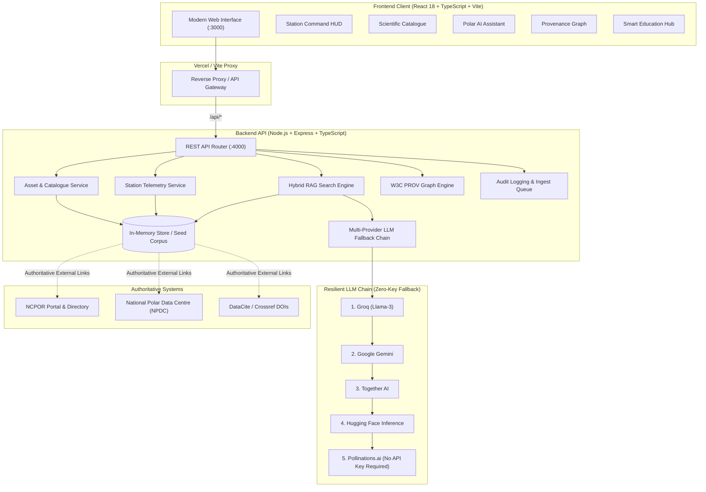

# ❄️ PolarConnect

> **Smart India Hackathon 2026** | **Problem Statement ID: 26063**  
> **Ministry of Earth Sciences (MoES) / National Centre for Polar and Ocean Research (NCPOR)**  
> *Integrated Polar Science Outreach, Knowledge Repository, and Media Dissemination Portal*

[](https://sihps63-main.vercel.app)
[](https://sihps63-main.vercel.app)
[](https://www.typescriptlang.org/)
[](https://react.dev/)
[](https://nodejs.org/)
[](https://vitejs.dev/)
[](https://tailwindcss.com/)
[](https://www.go-fair.org/fair-principles/)

---

## 📌 Executive Summary

**PolarConnect** is a state-of-the-art outreach and discovery portal for Indian and global polar science initiatives across **Antarctica, the Arctic, the Southern Ocean, and the Himalayas (Third Pole)**. 

Acting as a discovery and public engagement layer for the **National Centre for Polar and Ocean Research (NCPOR)** and the **National Polar Data Centre (NPDC)**, PolarConnect preserves scientific provenance, respects data governance and embargo policies, and delivers accessible science communication through grounded artificial intelligence.

---

## 🌟 Key Features

| Module | Description |
|---|---|
| **🌐 Station Command HUD** | Real-time telemetry, atmospheric condition monitors, and operational status for Indian research stations: **Maitri** (Antarctica), **Bharati** (Antarctica), **Himadri** (Svalbard, Arctic), and **Himansh** (Himalayas), plus the **IndARC** mooring observatory. |
| **🧭 Voyage to Impact Timeline** | Interactive chronologies of landmark Indian expeditions across the Arctic, Antarctic, and Southern Ocean with route waypoints, scientific objectives, vessel data, and cruise reports. |
| **📚 FAIR Scientific Catalogue** | Searchable metadata catalogue for datasets, expedition reports, and scientific media. Fully respects access states (**Open**, **Restricted**, **Embargoed**) with authoritative deep links to NPDC and citable DOIs. |
| **🤖 Grounded Polar AI Assistant** | Retrieval-Augmented Generation (RAG) assistant delivering evidence-based polar science answers with source citations, confidence indicators, and a robust multi-provider fallback chain. |
| **🧬 W3C PROV Provenance Graph** | Visual data lineage tracing how raw sensor telemetry and expedition logs transform into research datasets and public science stories. |
| **📝 AI Science Communication Studio** | Tailored content generator transforming complex polar research papers into accessible press releases, classroom explainers, and social media outreach. |
| **🎓 Smart Education Hub** | Interactive learning modules, gamified polar science quizzes, and visual field guides designed for school students and university educators. |
| **🛡️ Curator & Ingest Pipeline** | Ingestion wizard with schema validation, embargo date scheduling, rights holder declarations, and curator approval queues with full audit logging. |

---

## 🏗️ System Architecture



---

## 🛠️ Technology Stack

- **Frontend**: React 18, TypeScript, Vite, Tailwind CSS, Lucide Icons, Mermaid.js
- **Backend**: Node.js, Express, TypeScript, RESTful architecture
- **Knowledge & RAG Engine**: Custom TF-IDF & semantic vector similarity, hybrid reranking, source citation grounding
- **AI Integration**: Multi-provider fallback chain (Groq, Google Gemini, Together AI, Hugging Face, Pollinations.ai)
- **Data Governance**: W3C PROV-O data lineage, FAIR (Findable, Accessible, Interoperable, Reusable), CARE indigenous & environmental principles
- **Deployment**: Vercel multi-service monorepo configuration with unified routing

---

## 🚀 Getting Started

### Prerequisites

- **Node.js** 18.0.0 or higher
- **npm** 9.0.0 or higher
- Git

### Installation

1. **Clone the repository:**
   ```bash
   git clone https://github.com/TruCoded/sih_ps_63.git
   cd sih_ps_63
   ```

2. **Install all workspace dependencies:**
   ```bash
   npm install
   ```

3. **Configure Environment Variables (Optional):**
   The application includes an automatic no-key fallback via Pollinations.ai, so it works out of the box without any keys!  
   If you wish to use dedicated high-speed LLM providers, create `apps/api/.env`:
   ```env
   PORT=4000
   GROQ_API_KEY=your_groq_api_key_here
   GEMINI_API_KEY=your_gemini_api_key_here
   TOGETHER_API_KEY=your_together_ai_key_here
   HUGGINGFACE_API_KEY=your_hf_key_here
   ```

### Running Locally

You can launch both the backend API and frontend in separate terminals:

**Terminal 1 — API Server:**
```bash
npm run dev:api
```
*API will start on http://localhost:4000 (Health check: http://localhost:4000/api/health)*

**Terminal 2 — Frontend Application:**
```bash
npm run dev:web
```
*Web application will open on http://localhost:3000*

> 💡 **Windows Quick Start:** On Windows machines, simply double-click or run `start-demo.bat` to automatically start both servers and launch the portal in your default browser.

---

## 📜 Available NPM Scripts

| Command | Description |
|---|---|
| `npm run dev:web` | Start the Vite frontend in development mode on port 3000 |
| `npm run dev:api` | Start the Express API in development mode on port 4000 |
| `npm run build:web` | Type-check and compile the frontend production bundle |
| `npm run build:api` | Compile the TypeScript backend to `apps/api/dist` |
| `npm run install:all` | Reinstall dependencies across all monorepo workspaces |

---

## 📡 REST API Endpoints

| Endpoint | Method | Description |
|---|---|---|
| `/api/health` | `GET` | Health check and active LLM provider diagnostics |
| `/api/stations` | `GET` | Station telemetry, coordinates, and weather metrics |
| `/api/expeditions` | `GET` | Timeline records for Arctic, Antarctic, and Southern Ocean voyages |
| `/api/assets` | `GET`, `POST` | FAIR scientific asset catalogue and new asset ingestion |
| `/api/rag/ask` | `POST` | Grounded AI Q&A with citations and confidence scoring |
| `/api/rag/benchmark` | `GET` | RAG retrieval evaluation metrics and benchmark suite |
| `/api/content-drafts` | `POST` | AI science communication draft generation |
| `/api/provenance/:id` | `GET` | W3C PROV lineage graph for a given asset |
| `/api/education/modules`| `GET` | Educational learning modules and quiz data |
| `/api/audit` | `GET` | Immutable system audit log records |

---

## ☁️ Deployment on Vercel

The project is structured as a Vercel-ready monorepo with [`vercel.json`](vercel.json) configuring automated multi-service routing:

- `apps/web` is deployed as the client web application.
- `apps/api` is deployed as the serverless API service.
- All `/api/*` requests are seamlessly routed to the API service.

### Quick Deploy via Vercel CLI:
```bash
npx vercel
```

### Deploy via Vercel Web Dashboard:
1. Connect your GitHub account and import `https://github.com/TruCoded/sih_ps_63`.
2. Keep the root directory as `./`.
3. Add any optional LLM API keys in the **Environment Variables** settings.
4. Click **Deploy**.

---

## 📂 Repository Structure

```text
sih_ps_63/
├── apps/
│   ├── api/                    # Express + TypeScript REST API
│   │   ├── src/
│   │   │   ├── routes/         # Modular endpoint handlers (stations, assets, rag, etc.)
│   │   │   ├── services/       # Business logic (LLM chain, RAG engine, in-memory store)
│   │   │   └── types/          # Backend TypeScript interfaces
│   │   └── package.json
│   └── web/                    # React 18 + TypeScript + Vite Frontend
│       ├── public/             # Static public assets, icons, and imagery
│       ├── src/
│       │   ├── components/     # UI components (HUD, Catalogue, RAG Assistant, etc.)
│       │   ├── App.tsx         # Main application container
│       │   └── index.css       # Tailwind CSS & custom design tokens
│       └── package.json
├── docs/                       # Architectural specs, API contracts, governance guidelines
├── infra/
│   └── seed/                   # Seed corpus manifest & realistic scientific demo data
├── packages/
│   └── shared-types/           # Shared TypeScript interfaces across web and API
├── vercel.json                 # Vercel monorepo routing specification
├── start-demo.bat              # One-click Windows startup script
└── README.md                   # Project documentation
```

---

## ⚖️ Data Governance & Attribution

- **Institutional Attribution**: All station datasets, expedition records, and scientific metadata are attributed to the **Ministry of Earth Sciences (MoES)** and the **National Centre for Polar and Ocean Research (NCPOR)**.
- **Controlled Linking**: This discovery layer points directly to official NPDC repositories rather than replicating or circumventing national archives.
- **Embargo Compliance**: Supports time-locked dataset discovery where metadata is visible while underlying raw data remains protected until the formal embargo expiration date.

---

## 👥 Contributors & Acknowledgements

Developed for the **Smart India Hackathon (SIH 2026)** — **Problem Statement 26063**.  
Special thanks to **MoES** and **NCPOR** for supporting Indian polar exploration and science research.
