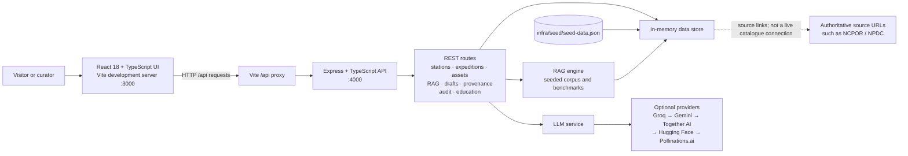

# PolarConnect

PolarConnect is a prototype outreach and discovery portal for polar science. It brings expedition information, station telemetry, research assets, educational content, and AI-assisted discovery together in one web application. The project is scoped as a public-facing discovery layer for MoES, NCPOR, and NPDC—not as a replacement for their authoritative data systems.

> **Prototype note:** The API currently loads demo records from `infra/seed/seed-data.json` into an in-memory store. Changes made while the server is running are not persisted after a restart. Asset download responses link to the authoritative source where available; this prototype does not mirror the NPDC data catalogue.

## Features

- Polar station telemetry and expedition views.
- A searchable, filterable asset catalogue with access-state-aware results.
- Contributor ingest drafts, curator review and publish flows, and audit events.
- Provenance graph views for asset records.
- A grounded RAG assistant, semantic asset search, and RAG benchmark endpoint.
- AI-assisted science communication drafts and education tools.
- Optional LLM provider configuration with a provider fallback chain.

## Architecture



The frontend and API are separate npm workspaces in this repository. During development, Vite proxies `/api` requests to the Express server. The API initializes its demo data from the JSON seed file and keeps runtime changes in memory. AI-backed features use the configured provider chain; provider keys are optional because Pollinations.ai is the final no-key fallback. A working network connection is needed for calls to external AI providers.

For the broader design principles and API details, see [docs/architecture.md](docs/architecture.md), [docs/api-contract.md](docs/api-contract.md), and [docs/data-governance.md](docs/data-governance.md).

## Requirements

- Node.js 18 or later
- npm

## Getting started

From the repository root, install all workspace dependencies:

```bash
npm install
```

Start the API and frontend in **separate terminals**:

```bash
npm run dev:api
```

```bash
npm run dev:web
```

Open [http://localhost:3000](http://localhost:3000). The frontend proxies API requests to `http://localhost:4000`.

On Windows, after installing dependencies, you can also run `start-demo.bat` to launch both development servers and open the app in a browser.

### Optional AI provider keys

The API works without provider keys, using its final fallback provider. To configure providers, create `apps/api/.env` and add any keys you have:

```dotenv
GROQ_API_KEY=
GEMINI_API_KEY=
TOGETHER_API_KEY=
HUGGINGFACE_API_KEY=
```

The API checks configured providers in this order: Groq, Gemini, Together AI, Hugging Face, then Pollinations.ai. Model names can optionally be set with `GROQ_MODEL`, `GEMINI_MODEL`, and `TOGETHER_MODEL`. Do not commit API keys.

## Scripts

Run these commands from the repository root:

| Command | Description |
| --- | --- |
| `npm run dev:api` | Start the API in watch mode on port 4000. |
| `npm run dev:web` | Start the Vite frontend on port 3000. |
| `npm run build:api` | Type-check and compile the API to `apps/api/dist`. |
| `npm run build:web` | Type-check and build the frontend to `apps/web/dist`. |

Check API availability at [http://localhost:4000/api/health](http://localhost:4000/api/health) while the API is running.

## Repository layout

```text
apps/
  api/                 Express API, route handlers, services, and types
  web/                 React application and Vite configuration
docs/                  Architecture, API contract, governance, and demo notes
infra/seed/            Demo corpus and seed records
packages/shared-types/  Shared TypeScript types
start-demo.bat         Windows helper to start both development servers
```

## Data and integrations

The seed corpus includes demo station, expedition, and asset records. The current implementation uses an in-memory store initialized from this seed file; it does not currently use Redis or Meilisearch as its application datastore or search backend. NCPOR / NPDC records are represented by metadata and authoritative links, not by a live integration or copied catalogue.

Treat demo telemetry and records as illustrative. Before production use, connect approved data sources, define durable storage and authentication, and review source terms, licences, and access policies.
